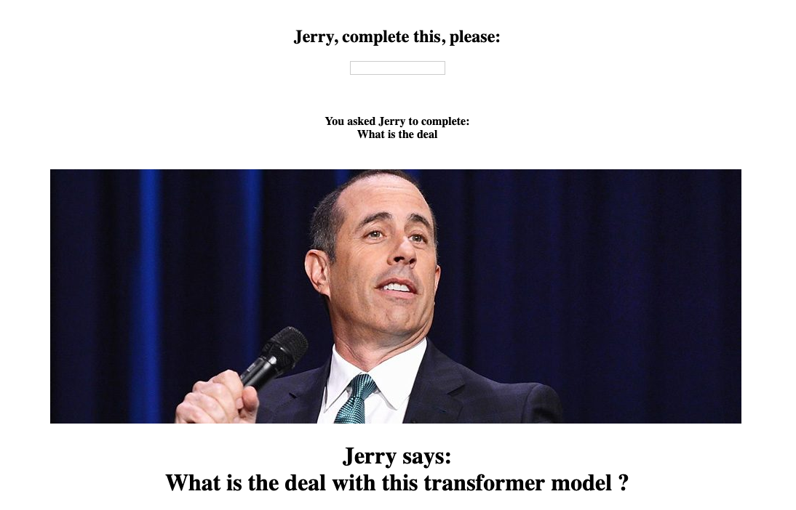

# Jerry Says

Try to predict how Jerry Seinfeld would finish a given incomplete sentence.

#### Dataset for this project is obtained from https://www.kaggle.com/thec03u5/seinfeld-chronicles
and can be found in /seinfeld_scripts.

## Instructions

### Git clone the code and install it as a python library
```
git clone https://github.com/ArbinTimilsina/JerrySays.git
cd JerrySays
pip install -e .
```

### Download SpaCy english model; needed for tokenization
```
python -m spacy download en
```

### To train the model:
```
train-jerry --help

# example
train-jerry -epoch 10 -batch_size 500
```

### To use the model:
```
serve-jerry
```
Paste the following into a web browser and follow along...
```
http://localhost:5050
```

You will get output similar to



Training for 1 epoch takes around a minute in a CPU (for default batch size). 

Have fun!!

